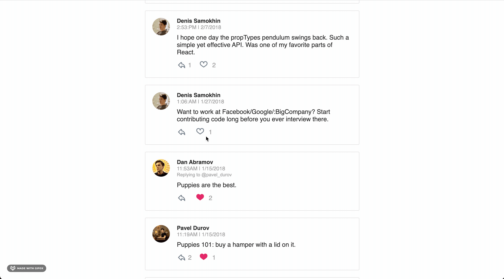

# Chirper App

[React Chirper App](https://github.com/GonEbal/chirper-app.git).

## Project Setup

* clone the Project - `https://github.com/GonEbal/chirper-app.git`
* install the dependencies - `npm install` or `yarn`
* launch the application - `npm start` or `yarn run`
* The project can be viewed in the browser at - http://localhost:3000

## Contributing

If you feel like there's a major problem, please open an issue to discuss the problem and potential resolution.

## License

MIT
